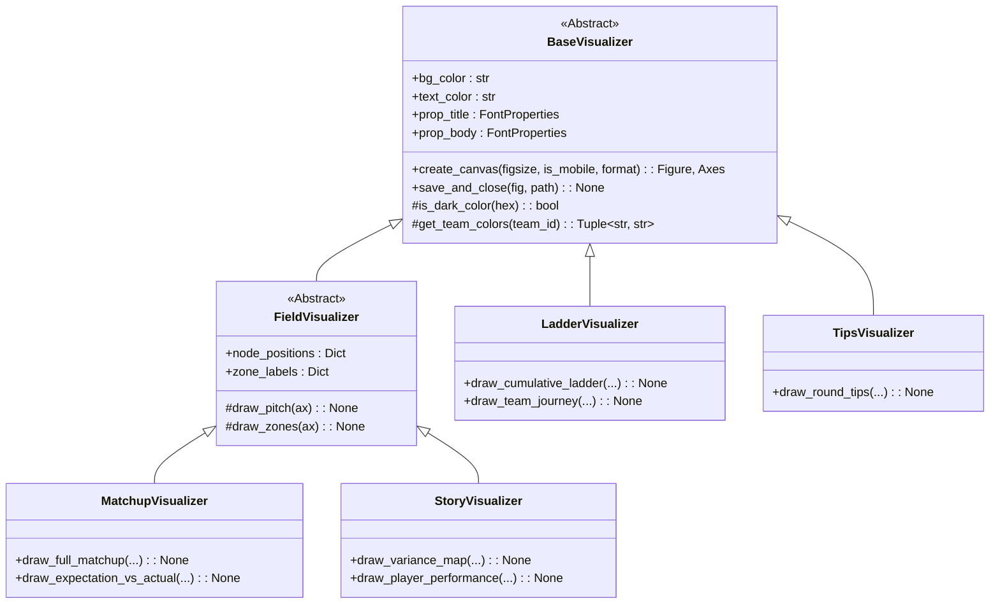

# Architectural Assessment: Opportunities for Object-Oriented & Modular Design

This document evaluates the opportunities to transition the FootyRecord codebase (focusing on visualization, ELO math, data ingestion, and orchestration) into a highly modular, DRY (Don't Repeat Yourself), and Object-Oriented (OO) structure.

---

## 1. Current Architectural Critique

The current V3 codebase successfully organizes functionality into layers (Data, Core, Visualizer). However, the implementation within these layers is largely procedural code wrapped in class namespaces. This has led to several architectural vulnerabilities:

1. **High Code Duplication (DRY Violations):**
   * The coordinates, pitch boundaries, and layout measurements are hardcoded repeatedly across multiple visualizers (`visualize_matchup.py`, `visualize_story.py`).
   * Team formatting, name-shortening (`get_short_name`), and color-darkness algorithms are copied and pasted across files.
   * Matplotlib canvas initialization, styling setup, and save/close routines are duplicated.
2. **Procedural Orchestration:**
   * `generate_round_images.py` is a monolithic script that manually loops, calls scraper functions, performs ELO lookups, handles file path building, catches exceptions, and renders output.
3. **Lack of Domain Modeling:**
   * Entities like `Match`, `Team`, and `Player` are passed around as raw dictionaries or nested structures (`Dict[str, Dict[Tuple[str, str], float]]`), leading to complex key management and high risk of exceptions.

---

## 2. Proposed Object-Oriented Visualizer Architecture

By moving to a subclassing and component-driven layout, we can unify styling, layouts, and canvas setup while keeping individual graphics modular.

### A. Class Hierarchy Diagram



### B. Reusable Render Components (Strategy Pattern)

Instead of duplicating rendering routines, visualizers can delegate specific parts of the layout to dedicated renderer classes:

1. **`FieldRenderer`:** Draws the oval pitch, center square, coordinate zones, and labels onto a Matplotlib axis.
2. **`VectorRenderer`:** Draws flow vectors. This class will encapsulate the arrow thickness mapping, color blending, and the **180-degree opponent rotation logic** (resolving the field-spanning arrow bug).
3. **`TableRenderer`:** Encapsulates table drawing logic. This includes calculating row heights, matching cell borders, checking brightness contrasts, and choosing font sizing dynamically depending on desktop/mobile target aspect ratios.
4. **`CardRenderer`:** Handles bounding boxes (`FancyBboxPatch`) and multiline text layouts for cards (e.g. winner cards, player profile cards) with responsive padding adjustments.

---

## 3. Modularizing Ingestion & Core Mathematics

Moving ingestion and modeling to a **Domain-Driven Design (DDD)** structure prevents data corruption and unifies calculations.

### A. Domain Models (`models.py`)

Define rich domain objects using Python `dataclasses` or `pydantic` to enforce type safety and self-documentation:

```python
from dataclasses import dataclass
from typing import Dict, List, Tuple

@dataclass(frozen=True)
class Coordinate:
    x: float
    y: float
    
    def to_grid(self) -> str:
        # Relocate grid mapping logic here (DRY-compliant)
        pass

@dataclass
class Player:
    player_id: str
    name: str

@dataclass
class Team:
    team_id: str
    name: str
    primary_color: str
    secondary_color: str
    
    @property
    def is_dark(self) -> bool:
        # Centralize color darkness analysis
        pass

@dataclass
class MatchInfo:
    match_id: str
    season: int
    round_num: int
    home_team: Team
    away_team: Team
    home_score: int = 0
    away_score: int = 0
    
    @property
    def winner(self) -> Team:
        pass
```

### B. Encapsulated Subsystems

1. **`EloEngine`:**
   * Encapsulates ELO updates, cross-season carry-overs (with regression-to-mean parameters), and draw evaluations.
   * Manages retrieval of historical ratings, resolving the off-by-one round ELO storage issue.
2. **`CacheManager`:**
   * Isolates serialization logic (`pickle`, `SQLite`, or `Parquet`).
   * Evaluates fine-grained invalidation (e.g., loading static historical years from a read-only cache while rebuilding only the active season's data).
3. **`DataPipeline`:**
   * Coordinates scraping, CSV loading, and profiling operations.
   * Implements robust error recovery and rate-limiting wrappers around network sessions.

---

## 4. Proposed Refactoring Roadmap

To transition to this model safely without breaking current image generation, we recommend a phased approach:

```
[Phase 1: Domain & Themes] -> [Phase 2: Base & Component Visualizers] -> [Phase 3: Core & ELO Engine] -> [Phase 4: Pipeline Orchestrator]
```

1. **Phase 1: Domain & Themes (Low Risk)**
   * Centralize team attributes, abbreviation mappings, and color-brightness checks in a refactored `theme.py` and `mappings.py`.
   * Create standard models in `models.py`.
2. **Phase 2: Visualizer Base & Components (Medium Risk)**
   * Write the `BaseVisualizer` class. Refactor `visualize_matchup.py` and `visualize_story.py` to subclass it, removing duplicated canvas setup code.
   * Extract the arrow-drawing logic into a dedicated `VectorRenderer` component and implement the correct 180-degree rotation.
3. **Phase 3: Core Ingestion & ELO Engine (Medium-High Risk)**
   * Extract ELO computations from `engine_data.py` into a separate `EloEngine` class.
   * Fix cross-season ELO ratings carry-over and query season-locking bugs.
4. **Phase 4: Pipeline Orchestrator (Medium Risk)**
   * Replace the scripting logic in `generate_round_images.py` with a `RoundProductionPipeline` class.
   * Dynamically determine round matches (removing the hardcoded `1` to `10` loop) and hook up roster fetching securely.
