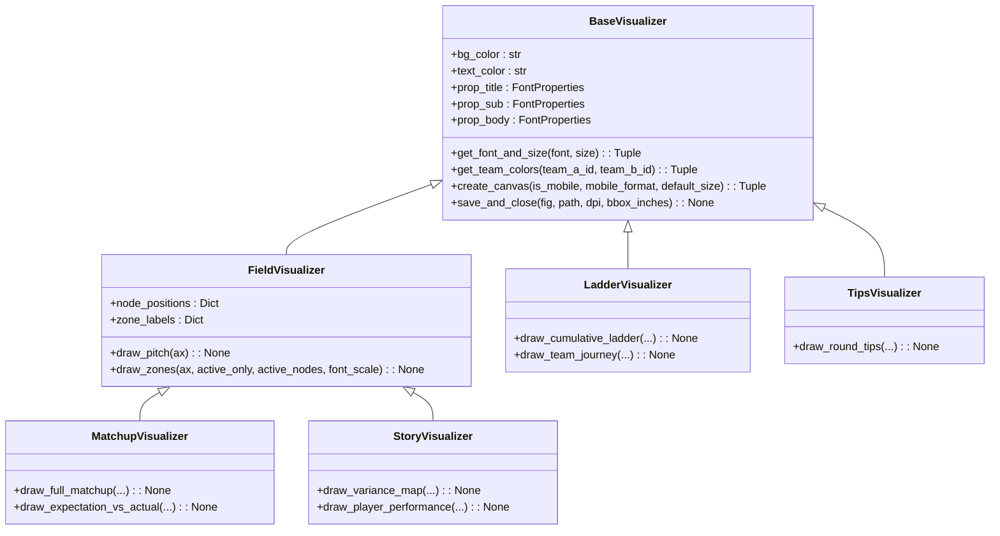

# Refactoring Summary: Object-Oriented & Modular Architecture

This document summarizes the refactoring of the FootyRecord codebase into a clean, object-oriented, and modular architecture, following the roadmap in `modular_oop_assessment.md`.

---

## Architecture Overview

---

## Phase 1: Domain & Themes

1. **`Core/theme.py`**:
   - Centralized color darkness checks with `is_dark_color(hex_color: str) -> bool`.
   - Cleaned up duplicated structures and unified standard palette constants (`BG_COLOR`, `TEXT_COLOR`, etc.).
2. **`Core/mappings.py`**:
   - Added a centralized `get_short_name(name: str) -> str` function to handle team name abbreviations.
3. **`Core/models.py`**:
   - Implemented dataclasses `Coordinate`, `Player`, `Team`, and `MatchInfo`.
   - Supported backwards compatibility in `MatchInfo` (retaining `season`, `round`, `home`, and `away` fields while adding properties like `round_num`, `home_team`, `away_team`, and `winner`).

---

## Phase 2: Visualizer Base & Components

1. **`Core/base_visualizer.py` (New)**:
   - Encapsulates basic visualizer state (colors, title/sub/body font configurations).
   - Centralizes canvas creation via `create_canvas` and safe file writing/closing via `save_and_close`.
   - Unifies the **Wallpoet size fallback** check (`get_font_and_size`) to prevent text rendering glitches at small sizes.
2. **`Core/field_visualizer.py` (New)**:
   - Subclasses `BaseVisualizer` to draw AFL pitch layouts (`draw_pitch`) and circular grid zones (`draw_zones`) onto Matplotlib axes.
3. **`Core/vector_renderer.py` (New)**:
   - Encapsulates flow-arrow layouts, arrow-scaling mathematics, and alpha blur effects.
   - **Resolved Field-Spanning Arrow Bug**: Implemented explicit swap logic for `'SCORE' <-> 'AWAY_G'` coordinates depending on whether the away team's perspective is active, preventing arrows from crossing the entire field.
4. **Visualizer Refactoring**:
   - Refactored all four visualizers (`visualize_matchup.py`, `visualize_story.py`, `visualize_ladder.py`, `visualize_tips.py`) to inherit from `BaseVisualizer` or `FieldVisualizer`, deleting hundreds of lines of duplicate setup code.

---

## Phase 3: Core Ingestion & ELO Engine

1. **`Core/elo_engine.py` (New)**:
   - Isolates ELO math, margin multipliers, season roll-overs, and draw evaluations.
   - **Resolved Off-by-One ELO Retrieval Bug**: Instead of querying ELO from a historical list where entries are appended *before* each match (which caused a round lag during query lookups), ELO ratings are indexed in `team_elo_by_round` by `(season, round_num)` to denote their state at the end of each round. Lookups fallback recursively to the previous round if a team had a bye.
2. **`Core/engine_data.py`**:
   - Trimmed down `DataIngestor` to focus strictly on loading stats CSVs, profiling chains, and caching state.
   - Delegated all ELO storage and calculations to `EloEngine`. Added a robust fallback in `load_all_data` to rebuild ELO state dynamically when loading legacy pickle caches.

---

## Phase 4: Pipeline Orchestrator

1. **`generate_round_images.py`**:
   - Refactored procedural code into a clean `RoundProductionPipeline` orchestrator class.
   - Removed hardcoded game loops (originally limited to `1` through `10`) in favor of dynamic match collection for the specified season and round.
   - Handled rosters, prediction calculations, and modular visualizer invocations cleanly.
